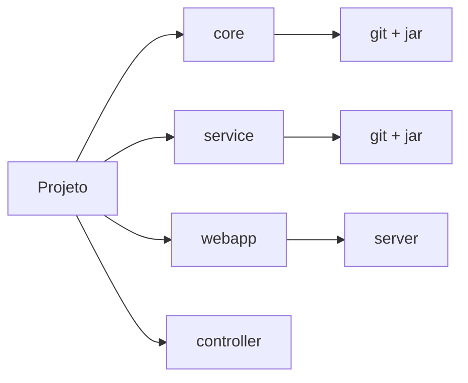
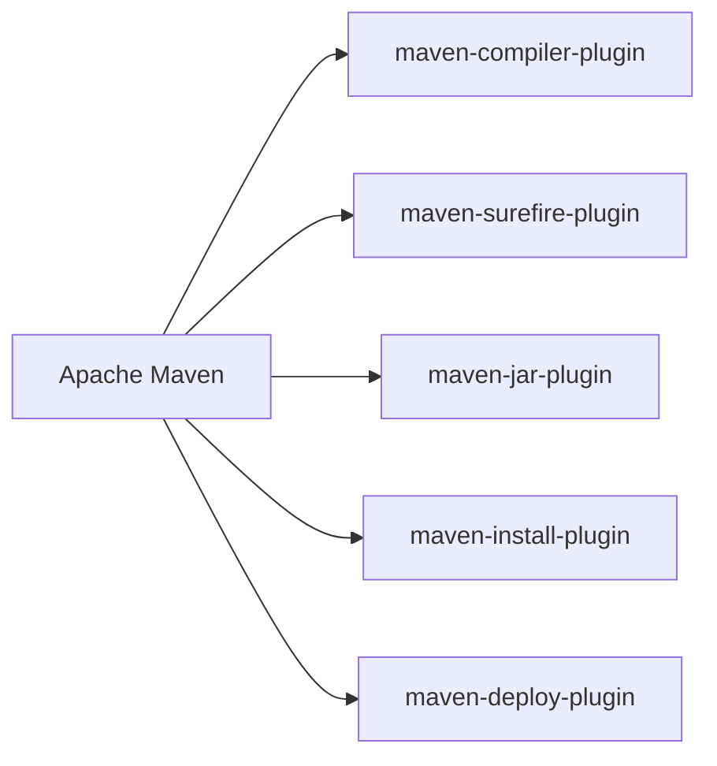

# Gerenciamento de dependências com Maven

O projeto Java presente neste repositório foi criado por meio do Maven e contém testes unitários com JUnit.  
O template (_archetype_) utilizado foi o `maven-archetype-quickstart`.

Ao gerar um projeto com um _archetype_, o Maven cria uma estrutura de diretórios e arquivos padrão.  
Segue abaixo o comando utilizado para criar o projeto:

```bash
mvn archetype:generate -DgroupId=dev.theduardomaciel -DartifactId=maven-tests -DarchetypeArtifactId=maven-archetype-quickstart -DinteractiveMode=false
```

> Legenda:
> - **groupId:** é o identificador único do projeto, geralmente é o nome do pacote Java reverso. (ex: br.com.empresa.projeto)
> - **artifactId:** é o nome do projeto. (ex: projeto-maven)
> - **archetypeArtifactId:** é o identificador do archetype a ser utilizado. (ex: maven-archetype-quickstart)
> - **interactiveMode:** é um parâmetro que indica se o Maven deve perguntar ao usuário sobre as configurações do projeto.

### Comandos úteis

```bash
mvn compile # Para compilar o projeto
mvn test # Para testar o projeto
mvn package # Para empacotar o projeto
mvn clean # Para limpar o projeto
```

### POM (Project Object Model)

O arquivo `pom.xml` é o arquivo de configuração do Maven. Ele detalha como o projeto deve ser construído, empacotado e instalado.  
Alguns elementos importantes configurados no `pom.xml` são:
- Nome do projeto
- Dependências
- Módulos
- Configurações de build
- Detalhes do projeto (nome, descrição, licença, etc.)
- Configurações de ambiente (repositórios, tracking, profiles, etc.)

Um arquivo mínimo teria a seguinte forma:

```xml
<project>
  <modelVersion>4.0.0</modelVersion>
 
  <groupId>com.mycompany.app</groupId>
  <artifactId>my-app</artifactId>
  <version>1</version>
</project>
```

> Obs.: A título de curiosidade, essas informações _não são suficientes_ para o Maven realizar os processos que precisa, no entanto, são suficientes para que o Maven as complete com valores padrão disponíveis no "Super POM", do qual o arquivo `pom.xml` é "estendido".  
> Um exemplo de "SuperPOM" está disponível [aqui](https://maven.apache.org/ref/3.0.4/maven-model-builder/super-pom.html).

### Repositórios

São locais onde é possível encontrar plugins e bibliotecas que o Maven pode baixar e utilizar. Assim sendo, o Maven possui um repositório central onde estão disponíveis diversas dependências.
Possuem dois tipos: locais e remotos.

#### Repositórios remotos

São repositórios que estão disponíveis na internet. O repositório central do Maven é um exemplo de repositório remoto.  
A configuração pode ser realizada por meio de dois métodos:

1. Arquivo `pom.xml` do projeto:
  ```xml
  <project>
    <repositories>
      <repository>
        <id>central</id>
        <url>https://repo.maven.apache.org/maven2</url>
      </repository>
    </repositories>
  </project>
  ```

2. Arquivo `settings.xml`, disponível no diretório `[PASTA_MAVEN]/conf` (onde `[PASTA_MAVEN]` é o diretório onde o Maven foi instalado):
  ```xml
  <settings>
    <profiles>
      <profile>
        <repositories>
          <repository>
            <id>central</id>
            <url>https://repo.maven.apache.org/maven2</url>
          </repository>
        </repositories>
      </profile>
    </profiles>
  </settings>
  ```

#### Repositórios locais

São repositórios que estão no computador do desenvolvedor. São utilizados pelo Maven como uma **estratégia de cache** ao buscar pelos artefatos baixados.  
O Maven cria um repositório local na pasta `~/.m2/repository` (Linux) ou `C:\Users\username\.m2\repository` (Windows).

##### ⁉️ Como funciona?

Quando o Maven precisa de uma dependência, ele busca no repositório local. Se não encontrar, ele busca no repositório remoto e baixa a dependência.

#### Como adicionar dependências

Para adicionar dependências ao projeto, basta adicionar o elemento `<dependencies>` no arquivo `pom.xml` do projeto, caso não exista.  
Após adicionar o elemento `<dependencies>`, basta adicionar as dependências desejadas dentro dele.

```xml
<project>
  <dependencies>
    <dependency>
      <groupId>org.hibernate</groupId>
      <artifactId>hibernate-search-orm</artifactId>
      <version>5.11.9.Final</version>
    </dependency>
  </dependencies>
</project>
```

> Legenda de propriedades:
> - **groupId:** é o identificador do grupo/organização da dependência. Segue as mesmas regras de nomenclatura de pacotes Java.
> - **artifactId:** é o identificador do artefato (biblioteca/projeto) que será utilizado.
> - **version:** é a versão da dependência que será utilizada.

#### Tipos de dependências

Para publicar um projeto no repositório local, é necessário empacotá-lo. Para isso, basta executar o comando `mvn install`.  
Após realizar o empacotamento, o projeto estará disponível no repositório local e poderá ser utilizado por outros projetos.

O Maven possui diversos dois tipos de dependências, sendo elas:

1. Diretas: são as dependências **utilizadas diretamente** no projeto. São as que estão declaradas no arquivo `pom.xml` do projeto.
2. Transitivas: são as **dependências obrigatórias das dependências declaradas** (no arquivo `pom.xml`) do projeto.

#### Transitividade e Escopo

#### Classpath

O Maven utiliza o conceito de _classpath_ para gerenciar as dependências de um projeto.
Os possíveis valores para o _classpath_ são:
- `compile`: é o escopo padrão. As dependências com esse escopo estarão disponíveis em todas as fases do projeto.
- `test`: as dependências com esse escopo estarão disponíveis apenas na fase de testes.
- `runtime`: as dependências com esse escopo estarão disponíveis na fase de execução.

> Para visualizar o _classpath_ de um projeto, basta executar um dos seguintes comandos:
> ```bash
>    mvn dependency:build-classpath -DincludeScope=runtime
>    mvn dependency:build-classpath -DincludeScope=test
>    mvn dependency:build-classpath -DincludeScope=compile
>  ```

#### Escopos
As dependências transitivas trazem diversos problemas, sendo um deles a **importação de dependências não desejadas** para o projeto.  
Como problemas adjacentes, podem ocorrer:
1. diversos conflitos de versões
2. um aumento do tamanho do pacote `.jar` do projeto.

Para mitigar esse problema, o Maven provê escopos para limitar a transitividade das dependências.  
Existem 6 tipos de escopos que podem ser utilizados:

##### Escopo `compile`
- **É o escopo padrão**.
- A dependência está **disponível em todos os _classpath_**.
- **É transitivo**, ou seja, as dependências transitivas da dependência também estarão disponíveis em todas os _classpath_.

##### Escopo `provided`

```bash
<dependency>
  <groupId>javax.servlet</groupId>
  <artifactId>javax.servlet-api</artifactId>
  <version>3.1.0</version>
  <scope>provided</scope>
</dependency>
```

- A dependência é fornecida **em tempo de execução** por uma implementação na JDK ou via container.  
  Exemplos: `Servlet API`, `jdbc`, `Java EE APIs`.
- A dependência é adicionada aos classpath usados para compilação (`compile`) e teste (`test`), mas não ao `runtime`.
- **Não é transitivo**.

##### Escopo `runtime`

```bash
<dependency>
  <groupId>mysql</groupId>
  <artifactId>mysql-connector-java</artifactId>
  <version>6.0.6</version>
  <scope>runtime</scope>
</dependency>
```

- Indica que a dependência **é necessária para a execução** do projeto, não para a compilação.
- A dependência é adicionada aos _classpath_ de execução (`runtime`) e teste (`test`), mas não ao `compile`.

##### Escopo `test`

```bash
<dependency>
  <groupId>junit</groupId>
  <artifactId>junit</artifactId>
  <version>4.12</version>
  <scope>test</scope>
</dependency>
```

- A dependência é necessária apenas para **compilar e executar testes**.
- A dependência é adicionada apenas ao _classpath_ de teste (`test`).
- **Não é transitivo**.

##### Escopo `system`

```bash
<dependency>
  <groupId>com.oracle</groupId>
  <artifactId>ojdbc6</artifactId>
  <version>5.0</version>
  <scope>system</scope>
  <systemPath>${basedir}/lib/ojdbc6.jar</systemPath>
</dependency>
```

- A dependência é **semelhante ao escopo `provided`**, mas o JAR é fornecido explicitamente pelo desenvolvedor.
- A dependência é adicionada aos _classpath_ de compilação (`compile`) e teste (`test`), mas não ao `runtime`.
- **Não é transitivo**.

> É importante notar que o escopo `system` [está deprecado](https://maven.apache.org/guides/introduction/introduction-to-dependency-mechanism.html#system-dependencies) e não deve ser utilizado.

##### Escopo `import`

```bash
<dependencyManagement>
  <dependencies>
    <dependency>
      <groupId>com.mycompany.app</groupId>
      <artifactId>my-project</artifactId>
      <version>1.2</version>
      <type>pom</type>
      <scope>import</scope>
    </dependency>
  </dependencies>
</dependencyManagement>
```

- É disponível apenas para **dependências do tipo `pom`**, com a tag `<dependencyManagement>`.
- Indica um processo de reutilizar dependências de outro projeto.

#### Observações

> [!NOTE]
> **Dependências opcionais:**   
> São dependências não necessárias para os projetos que irão reutilizar seu componente.
> ```bash
> <dependency>
>   <groupId>com.google.code.gson</groupId>
>   <artifactId>gson</artifactId>
>   <version>2.8.6</version>
>   <optional>true</optional>
> </dependency>
> ```

> [!NOTE]
> **Exclusão de dependências:**  
> Utilizadas quando o componente a ser utilizado compartilha uma biblioteca já possuída ou quando a dependência não é necessária.
> ```bash
> <dependency>
>  <groupId>org.apache.maven</groupId>
> <artifactId>maven-core</artifactId>
> <version>3.0</version>
> <exclusions>
>  <exclusion>
>  <groupId>org.apache.maven</groupId>
> <artifactId>maven-artifact</artifactId>
> </exclusion>
> </exclusions>
> </dependency>
> ```
> Neste exemplo, a dependência `maven-artifact` foi excluída da dependência `maven-core`.
>
> Obs.: As `exclusions` são geralmente utilizadas para excluir dependências transitivas em casos em que não é possível ter controle sobre as dependências oferecidas pelos fornecedores de um componente.

### Maven Build Lifecycle

Basicamente, é o ciclo de vida de um projeto Maven.
- Cada ciclo de vida é composto por **fases** (Maven Phases), executadas em sequência.
- Cada fase é composta por **goals** (Maven Goals), que são tarefas específicas.

O Maven possui 3 ciclos de vida padrão:

1. **default:** é o ciclo de vida padrão do Maven, responsável pelo build local.  
   Possui 23 fases, sendo algumas delas:
  - `validate`
  - `compile`
  - `test-compile`
  - `test`
  - `integration-test`
  - `package`
  - `install`
  - `deploy`.
2. **clean:** é o ciclo de vida intermediário, responsável pela limpeza do projeto.  
   Possui 3 fases: `pre-clean`, `clean` e `post-clean`.
3. **site:** é o ciclo de vida final, que gera a documentação do projeto.  
   Possui 4 fases: `pre-site`, `site`, `post-site` e `site-deploy`.

### Projetos Multi-módulos

O Maven permite a criação de projetos multi-módulos, compostos por diversos módulos, como mostrado no exemplo abaixo:



Para iniciar um projeto multi-módulos, basta criar um projeto pai e realizar os seguintes passos:
1. Adicionar (ou alterar, caso já exista) a tag `<packaging>` no arquivo `pom.xml` deste projeto pai, para funcionar como `pom`.
   ```bash
   <packaging>pom</packaging>
   ```

2. Em seguida, navegue até a página pai no terminal (comando `cd`) e adicione novos módulos ao projeto pai, como no exemplo abaixo:
   ```bash
   mvn archetype:generate -DgroupId=dev.theduardomaciel -DartifactId=[NOME DO PACOTE] -Darchetype=maven-quick-start -DinteractiveMode=false
   ```

3. Após rodar o comando acima, o módulo será automaticamente adicionado ao arquivo `pom.xml` projeto pai. Caso não seja, adicione manualmente a tag `<modules>` e insira o nome do módulo, como no exemplo abaixo:
   ```bash
   <modules>
     <module>core</module>
   </modules>
   ```

Veja um exemplo de um arquivo `pom.xml` de um projeto pai:
```xml
<project>
  <modelVersion>4.0.0</modelVersion>
  <groupId>com.mycompany.app</groupId>
  <artifactId>my-app</artifactId>
  <version>1</version>
  <packaging>pom</packaging>
  <modules>
    <module>core</module>
    <module>service</module>
    <module>webapp</module>
    <module>controller</module>
  </modules>
</project>
```

### Plugins

Os plugins são responsáveis por adicionar funcionalidades ao Maven.  
Além disso, seguem um estilo arquitetural para extensibilidade, permitindo que desenvolvedores criem seus próprios plugins.

São escritos majoritariamente em Java e disponibilizados, normalmente, no formato de um arquivo `.jar`.
Seguem o seguinte padrão de nomenclatura: `maven-PLUGIN-PLUGINNAME`.
Abaixo está um exemplo de como o Apache Maven é organizado em plugins:



#### Uso

Para utilizar um plugin, basta seguir a sintaxe abaixo:

```bash
mvn [plugin-name]:[goal-name]
```

#### Configuração

A configuração de um plugin é feita no arquivo `pom.xml` do projeto.

```xml
<project>
  <build>
    <plugins>
      <plugin>
        <groupId>org.apache.maven.plugins</groupId>
        <artifactId>maven-compiler-plugin</artifactId>
        <version>3.8.1</version>
        <configuration>
          <release>11</release>
        </configuration>
      </plugin>
    </plugins>
  </build>
</project>
```

#### Exemplo

Para gerar um JavaDoc do projeto, basta utilizar o plugin `maven-javadoc-plugin`.

```xml
<plugin>
  <groupId>org.apache.maven.plugins</groupId>
  <artifactId>maven-javadoc-plugin</artifactId>
  <version>3.2.0</version>
  <configuration>
    <show>protected</show>
  </configuration>
</plugin>
```
